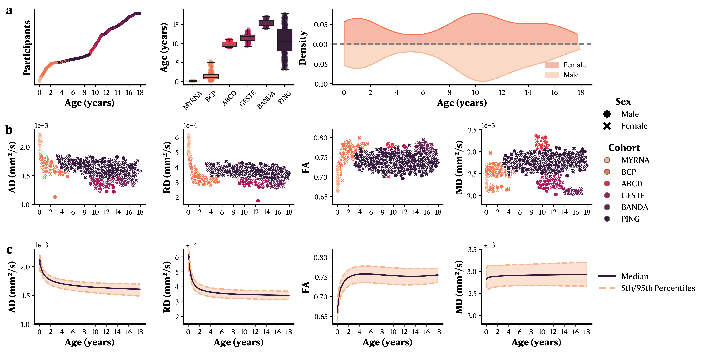

### **How are the priors generated?**

One innovative feature of `sf-pediatric` is how it uses normative curves of diffusivities in either single fiber population or ventricles to adapt some processing steps to each participant's age. For example, previous pipelines (e.g., TractoFlow) use either a set fiber response function (FRF) or compute the mean FRF across all study subjects. One crucial issue with both methods in pediatric samples lies in the rapid neurophysiological changes happening during this development period. Differences between a one-year old and a four-year old children can appear rather drastic. Using a single FRF for both or averaging all of them together in a single mean FRF both represent suboptimal solution. With the rise of normative models, we leveraged six pediatric cohorts spanning the whole 0-18 years old range to derive normative curves of FA, RD, AD values in single fiber population as well as MD values in the ventricles (see figure below).

:::note
While only the FRF and COMMIT priors are currently supported using normative curves, we are working to extend this method to other processing aspects to ensure the most optimal age appropriate processing of diffusion MRI acquisitions.
:::

Each of those median normative curves were approximate using single equations, and implemented into `sf-pediatric`. While this is the default option, users can still specify their own FRF using the parameter [`--frf_manual_frf`](/sf-pediatric/0.2.0/guides/parameters/#frf-options). Similarly, COMMIT priors can be specified with [`--commit_para_diff`](/sf-pediatric/0.2.0/guides/parameters/#commit-options), [`--commit_perp_diff`](/sf-pediatric/0.2.0/guides/parameters/#commit-options), and [`--commit_iso_diff`](/sf-pediatric/0.2.0/guides/parameters/#commit-options).
