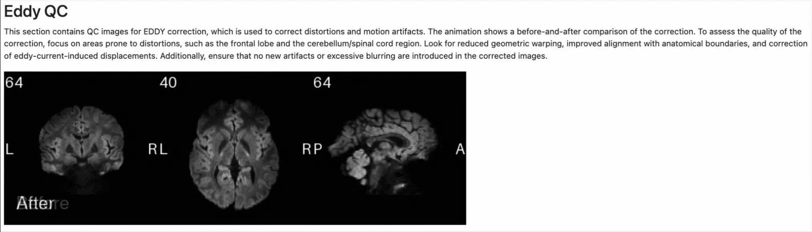

import { FileTree } from '@astrojs/starlight/components';
import { Steps } from '@astrojs/starlight/components';

As described in the [outputs section](/sf-pediatric/0.2.0/guides/outputs), you will find, in your output folder, two types
of MultiQC reports.

<Steps>
  1. A global population-wide report, located alongside your subject's output folders.
</Steps>

<FileTree>
  * sf-pediatric-v0.1.0/
  * dataset\_description.json
  * **multiqc/**
    * global-\{timestamp}\_data/
    * global-\{timestamp}.html
  * participants.tsv
  * sub-0001/
  * sub-0002/
  * ...
</FileTree>

<Steps>
  2. A subject-specific report, located within each subject output folder (if multiple sessions per subject,
     within each session subfolder).
</Steps>

<FileTree>
  * sf-pediatric-v0.1.0/
  * dataset\_description.json
  * multiqc/
  * participants.tsv
  * sub-0001/     # Example with session
    * ses-01/
      * anat/
      * dwi/
      * figures/
      * **multiqc/**
        * sub-0001\_ses-01-\{timestamp}\_data/
        * sub-0001\_ses-01-\{timestamp}\_plots/
        * sub-0001\_ses-01-\{timestamp}.html
      * xfm/
  * sub-0002/     # Example without session
    * anat/
    * dwi/
    * figures/
    * **multiqc/**
      * sub-0002-\{timestamp}\_data/
      * sub-0002-\{timestamp}\_plots/
      * sub-0002-\{timestamp}.html
    * xfm/
  * ...
</FileTree>

## **Opening the global QC report**

:::note[Getting a tour of MultiQC]
The MultiQC developers provide a [Youtube video](https://www.youtube.com/watch?v=qPbIlO_KWN0) describing how to
interact and navigate the MultiQC report. While this is not neuroimaging-tailored, it will give you a sense of
the inner workings of the MultiQC report.
:::

The main purpose of the global population-wide QC report is to enable an easy overview of the distribution
of some quality control metrics across your whole dataset. This report will **never contain subject-specific images**,
those can be found in the [subject-specific report](/sf-pediatric/0.2.0/guides/qc#opening-the-subject-specific-qc-report).
As such, you will mostly find plots showing data distribution that you can interact with to highlight potential outliers
that require further investigation. Let's start with the basics.

:::caution[A further investigation of outliers is **always** needed.]
When an outlier is spotted or labeled as *fail* for a specific characteristic, you should always investigate further
by looking at the subject-specific report or the output files directly. As an example, a specific subject might show
high movement during acquisition, resulting in a *fail* label for the framewise displacement metric, but it does not
necessarily mean that they should be excluded, since processing might have a done a great job of correcting for this
high movement.
:::

### **General statistics section**

:::note
If you processed a lot of subjects, this section will always be rendered as violin plots as it becomes quickly unreadable
in a table format. However, do not worry, you have the same amount of information in the violin plot form than the table
form.
:::

This section will always appear at the top of the MultiQC report. This is where you can get a bird's eye view of every
quality control metrics. You can zoom in on specific section of each violin plot by drawing a rectangle corresponding to
your desired field of view. Additionally, you can hover over single points to view the corresponding subject and session.

Each row in the general statistic section refers to a specific section that will be detailed further in the global report.
Let's take the example of the framewise displacement metric.

### **Looking at a specific section of the report**

Using either the menu on the left of the report, or simply by scrolling down, go to the **framewise displacement** section.
First thing that will get your attention is the green/yellow/red bar just beneath the section's title. This bar represents
the status of each subject, classified either within the *passed* (green), *warn* (yellow), and *fail* (red).

As you can see on the above screenshot, you have 3 subjects that were attributed a *pass* label, 5 subjects with a *warn*
label, and 2 subjects with a *fail* label. This is an automatic QC labelling that is performed as part of the pipeline,
and you can view the criteria used in the description text just below the status bar. In the example above, subjects with
a maximum framewise displacement over 2 mm were labeled as *fail*, while subjects between 0.8mm and 2mm were labeled as *warn*.
An interesting feature of the MultiQC report is that you can highlight those subjects by interacting with the status bar.
To do so, hover over the red section of the bar, a small menu will open, and simply click on highlight. In our case,
this will highlight the two subjects that were attributed the *fail* label throughout the whole report. You can now navigate
back to the general statistic section and see where they land on the distribution for the other sections.

Interacting using the status bar is possible in every section of the report, this will allow you to understand
which subjects are your outliers, and note them for further investigation. Once you've gone through the report,
start opening [subject-specific](/sf-pediatric/0.2.0/guides/qc#opening-the-subject-specific-qc-report) reports!

:::note[Leveraging the MultiQC toolbox]
In the above GIF, you can see a toolbox pop out in the window when we highlight the *fail* subjects. This is the
internal MultiQC toolbox that allows you to do much more than what is described here. To get a full tour of the
available features, head over to their [youtube video](https://www.youtube.com/watch?v=qPbIlO_KWN0) or their
[documentation section](https://docs.seqera.io/multiqc/reports)!
:::

## **Opening the subject-specific QC report**

Now that you spotted your outliers and created a list of subject-specific reports to open, let's have a quick tour of
what you can find in them. First, as mentioned above, you will find mostly images or GIFs showing visual assessment
of each subject data. Each section will come with its own description, telling you what to look for in the shown
image. Let's take the eddy susceptibility correction step as a reference.

When looking at the GIF above, we can see that the eddy correction step was successfully performed and the resulting image
is mostly free of distortions.

### **Touring the subject-specific report**

For now, we went through a single section showing the before and after eddy current correction. However, multiple other
sections are available in the report. Let's quickly go through them visually.

We can see that images are produced for the following sections:

* Q-space sampling with shell distribution
* Topup
* Framewise displacement
* eddy
* Diffusion metrics
* Anatomical to diffusion space registration
* Tissue segmentation
* Tracking coverage of the white matter
* Cortical/Subcortical segmentation
* Pipeline parameters and versions
* Methods boilerplate

For each of those sections, you will get a small description with details of what to look for. If you have any concerns
regarding how sf-pediatric processed your data, feel free to open an issue on our [GitHub repository!](https://github.com/scilus/sf-pediatric)

### **Using the methods boilerplate in publications**

Each report contains the same methods boilerplate that you can directly include in your publication. Users are encouraged to
use this pre-written method section, as it is dynamically tailored to the actual processing steps applied to your data.
