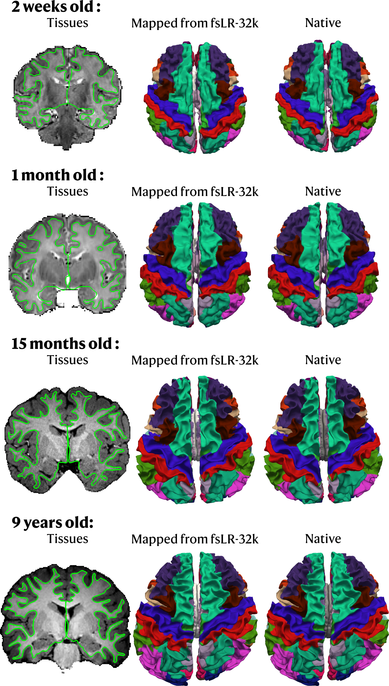

import { FileTree } from '@astrojs/starlight/components';
import { Tabs, TabItem } from '@astrojs/starlight/components';

By default, `sf-pediatric` will use the Brainnetome atlas for preadolescents<sup>1</sup> to perform connectomics analyses.
However, different analyses often require different cortical and subcortical atlases. To support flexible connectomics analyses,
users can provide their own custom atlas for connectome construction. This page covers the requirements and assumptions
behind using custom atlases. Additionally, we included [test results](/sf-pediatric/0.3.0/guides/atlases/#how-good-the-mapping-process-is)
comparing native segmentation with the mapped version from fsLR-32k to subject space.

## **Requirements**

`sf-pediatric` relies on surface- and volume-based registration techniques to transform template-space atlases into subject
space. To ensure that mapping between spaces is performed correctly, we follow the [BIDS definition for atlases](https://bids-specification.readthedocs.io/en/stable/derivatives/atlas.html)
and require that atlases be in the `space-fsLR_den-32k` space. Using the default Brainnetome atlas for preadolescents as an
example, the atlas folder should be structured as follows:

<FileTree>
  * \<atlases\_folder>/BrainnetomeChild/
    * atlas-BrainnetomeChild\_description.json
    * tpl-fsLR
      * **tpl-fsLR\_atlas-BrainnetomeChild\_den-32k\_dseg.dlabel.nii**
      * tpl-fsLR\_atlas-BrainnetomeChild\_den-32k\_dseg.json
      * tpl-fsLR\_atlas-BrainnetomeChild\_den-32k\_dseg.tsv
</FileTree>

The top-level `atlas-BrainnetomeChild_description.json` contains information on how the atlas was derived, relevant references,
the BIDS version, and other metadata. More information can be found [here](https://bids-specification.readthedocs.io/en/stable/derivatives/atlas.html#atlas-identification-and-metadata).
The subdirectory `tpl-<template>` must be named `tpl-fsLR`, since that is the only currently supported template. It must contain the atlas file
`*.dlabel.nii`, a corresponding `*.json` sidecar, and a `*.tsv` file containing label names, groups, and colors.
As an example, here is the `tsv` file for the Brainnetome for preadolescents atlas:

| index | label | cifti\_label | color\_red | color\_green | color\_blue | opacity |
|-------|--------|-------------|-----------|-------------|-----------|---------|
| 1 | SFG\_L\_6\_1 | SFG\_L\_6\_1 | 0 | 255 | 0 | 255 |
| 2 | SFG\_R\_6\_1 | SFG\_R\_6\_1 | 0 | 0 | 255 | 255 |
| 3 | SFG\_L\_6\_2 | SFG\_L\_6\_2 | 255 | 0 | 0 | 255 |
| 4 | SFG\_R\_6\_2 | SFG\_R\_6\_2 | 0 | 246 | 255 | 255 |
| ... | ... | ... | ... | ... | ... | ... |

:::caution[Bilateral regions should be numbered differently]
If your custom atlas contains **bilateral regions** (e.g., the Desikan atlas from FreeSurfer), you should assign **different
labels for to the left and right regions**. Otherwise, the mapping process may overwrite one hemisphere label by the other one.
For example, the right/left SFG\_(L/R)\_6\_2 in the Brainnetome Child atlas is labeled 3 and 4 respectively.
:::

The `*.dlabel.nii` file should contain cortical labels in fsLR-32k space and **subcortical structures** aligned with the
`MNI152NLin6Asym` template. To create your atlas in the correct space, we recommend using the [Connectome Workbench toolbox](https://www.humanconnectome.org/software/connectome-workbench).
A few already available atlases can be found in the [TemplateFlow archive](https://www.templateflow.org) (be sure that it
contains subcortical structures!).

## **Use your custom atlas in `sf-pediatric`**

In order for `sf-pediatric` to find your custom atlas, specify the folder containing your custom atlas with the
[`--atlas_folder`](/sf-pediatric/0.3.0/guides/parameters#atlases-options) and the
[`--atlas_name`](/sf-pediatric/0.3.0/guides/parameters#atlases-options) parameters. By default, `sf-pediatric` will
look for your atlas at: `${atlas_folder}/${atlas_name}`.

:::caution[If the pipeline can't find your folder]
If `sf-pediatric` can't find your atlas folder, it will return an error message similar to this:

```
ERROR ~ No such file or directory: /path/to/your/atlas
```

In this case, verify that the resolved path matches the location of your atlas and that the naming convention described above is respected.
:::

In addition to those two parameters, you **should also provide the subcortical indexes** for your atlas using [`--subcortical_rois`](/sf-pediatric/0.3.0/guides/parameters#atlases-options).
This allows the QC report to correctly visualize the segmented subcortical structures. **It is highly
recommended that you provide those indexes to get the most out of the QC report**.

### **Example command-line**

Starting from the basic example described in the [a simple example section](/sf-pediatric/0.3.0/guides/usage/#a-simple-example), specifying
a custom atlas through the `params.yml` file will look similar to this:

```yaml title="params.yml"
input: "/absolute/path/to/your/BIDS_directory"
outdir: "/absolute/path/to/results"
atlas_folder: "/absolute/path/to/folder"
atlas_name: "BrainnetomeChild"
subcortical_rois: "189:224"
```

<Tabs>
  <TabItem label="Command">
    ```bash
    nextflow run scilus/sf-pediatric -r 0.3.0 \
       -params-file params.yml \
       -profile docker,tracking \
       -resume
    ```
  </TabItem>
</Tabs>

:::note
This example uses the default atlas, but you can replace the atlas-specific arguments ([`--atlas_folder`](/sf-pediatric/0.3.0/guides/parameters#atlases-options),
[`--atlas_name`](/sf-pediatric/0.3.0/guides/parameters#atlases-options), and [`--subcortical_rois`](/sf-pediatric/0.3.0/guides/parameters#atlases-options)) with values for your own atlas. For more
information on the available parameters, see [this section](/sf-pediatric/0.3.0/guides/parameters/#atlases-options).
:::

:::caution[Using multiple different atlases]
To perform connectome analyses using different atlases, we recommend performing sequential pipeline runs with the different atlases
specified using [`--atlas_name`](/sf-pediatric/0.3.0/guides/parameters#atlases-options) as the pipeline does not currently iterate over multiple atlas names.
Using the `-resume` option, the pipeline will reuse previously cached processes, avoiding unnecessary recomputation of the segmentation.
**Don't forget to update [`--subcortical_rois`](/sf-pediatric/0.3.0/guides/parameters#atlases-options) when changing atlases!**
:::

## **How accurate is the mapping process?**

Transforming labels between spaces can introduce minor interpolation and registration errors. We evaluated whether
mapping from fsLR-32k space to native subject space closely matched native segmentation. Using test data, we performed
native segmentation with the Desikan atlas<sup>2</sup>. For younger participants (\< 1 year old), we used a combination of
[bibsnet](https://github.com/DCAN-Labs/BIBSnet)<sup>3</sup> and infant FreeSurfer<sup>4</sup> whereas
recon-all-clinical<sup>5</sup> was used for older participants. Following native segmentation, we mapped the
Desikan atlas (previously transformed into fsLR-32k space and formatted [as described in the requirements](/sf-pediatric/0.3.0/guides/atlases/#requirements))
from fsLR-32k space to native subject space.

Results are showcased in the figure below. Overall, the mapped and native segmentations showed close agreement across
participants and age groups:



## **References**

<sup>1</sup> Li, W., Fan, L., Shi, W., Lu, Y., Li, J., Luo, N., Wang, H., Chu, C., Ma, L., Song, M., Li, K., Cheng, L.,
Cao, L., & Jiang, T. (2023). Brainnetome atlas of preadolescent children based on anatomical connectivity profiles.
<i>Cerebral Cortex</i>, 33(9), 5264–5275. https://doi.org/10.1093/cercor/bhac415

<sup>2</sup> Desikan, R. S., Ségonne, F., Fischl, B., Quinn, B. T., Dickerson, B. C., Blacker, D., Buckner, R. L.,
Dale, A. M., Maguire, R. P., Hyman, B. T., Albert, M. S., & Killiany, R. J. (2006). An automated labeling system
for subdividing the human cerebral cortex on MRI scans into gyral based regions of interest. <i>NeuroImage</i>, 31(3),
968–980. https://doi.org/10.1016/j.neuroimage.2006.01.021

<sup>3</sup> Hendrickson, T. J., Reiners, P., Moore, L. A., Lundquist, J. T., Fayzullobekova, B., Perrone, A. J.,
Lee, E. G., Moser, J., Day, T. K. M., Alexopoulos, D., Styner, M., Kardan, O., Chamberlain, T. A., Mummaneni, A.,
Caldas, H. A., Bower, B., Stoyell, S., Martin, T., Sung, S., … Feczko, E. (2026). BIBSNet: A deep learning baby
image brain segmentation network for MRI scans. <i>Developmental Cognitive Neuroscience</i>, 79, 101706.
https://doi.org/10.1016/j.dcn.2026.101706

<sup>4</sup> Zöllei, L., Iglesias, J. E., Ou, Y., Grant, P. E., & Fischl, B. (2020). Infant FreeSurfer:
An automated segmentation and surface extraction pipeline for T1-weighted neuroimaging data of infants 0–2 years.
<i>NeuroImage</i>, 218, 116946. https://doi.org/10.1016/j.neuroimage.2020.116946

<sup>5</sup> Gopinath, K., Greve, D. N., Magdamo, C., Arnold, S., Das, S., Puonti, O., & Iglesias, J. E.
(2025). “Recon-all-clinical”: Cortical surface reconstruction and analysis of heterogeneous clinical brain MRI.
<i>Medical Image Analysis</i>, 103, 103608. https://doi.org/10.1016/j.media.2025.103608
