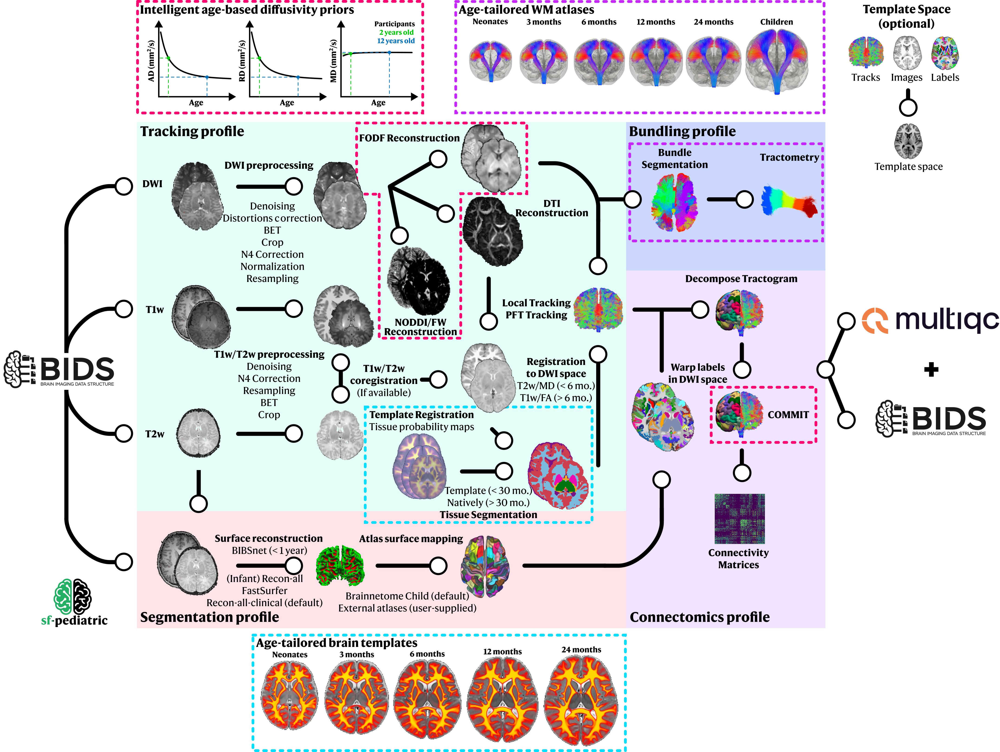

import { Steps } from '@astrojs/starlight/components';

## **What are profiles?**

Profiles let you choose which parts of the pipeline to run. Think of them as building blocks, you can use just one or combine several to create a pipeline run that suits your research aims.

:::tip[New to sf-pediatric?]
We recommend you start with **`-profile docker,tracking`** on a few subjects to process your raw diffusion MRI data. This will give you a sense of how the pipeline runs. You can add additional profiles afterwards.
:::

## **Types of profiles**

Every pipeline run needs:

1. **Configuration Profile** - How to run: `docker`, `apptainer`, `arm64`, or `slurm`
2. **Processing Profile(s)** - What to analyze: `tracking`, `segmentation`, `bundling`, `connectomics`

## **Processing Profiles**

`sf-pediatric` is organized into profiles, enabling total control over which processing steps are applied to your data. Currently, four profiles are available, enabling raw processing of dMRI data, white matter bundle analysis, or connectomics analysis.

<Steps>
  1. ### **`tracking`**

     This is the core profile behind `sf-pediatric`. By selecting it, DWI data will be preprocessed (denoised, corrected for distortion, normalized, resampled, ...). In parallel, T1w will be preprocessed (if `-profile segmentation` is not selected), registered into diffusion space, and segmented to extract tissue masks/maps. Tissue segmentation method will be adapted based on the subject's age. Preprocessed DWI data will be used to fit both the DTI and fODF models. As the final step, whole-brain tractography will be performed using both local tracking/particle filter tracking (PFT) and concatenated into a single tractogram.

     **Use this when:** You have raw diffusion MRI data.

     **Requires:** DWI data, T1w or T2w image, participant age in `participants.tsv`

  2. ### **`segmentation`**

     By selecting this profile, [FreeSurfer `recon-all`](https://surfer.nmr.mgh.harvard.edu/), [Recon-all-clinical](https://surfer.nmr.mgh.harvard.edu/fswiki/recon-all-clinical), [FastSurfer](https://deep-mi.org/research/fastsurfer/) or [BIBSnet](https://bibsnet.readthedocs.io/en/latest/)/[InfantFS](https://surfer.nmr.mgh.harvard.edu/fswiki/infantFS) will be used to process the T1w/T2w images.
     By default, the Brainnetome atlas for preadolescents ([Li et al., 2022](https://doi.org/10.1093/cercor/bhac415)) will be registered using surface-based methods in the native subject space.
     To use other atlases, please view the [Using custom atlases section](/sf-pediatric/0.3.0/guides/atlases/).

     **Use this when:** You need brain labels (required for `connectomics`).

     **Requires:** T1w image (or T2w), participant age in `participants.tsv`

     :::caution[FreeSurfer license required!]
     Get a free license [here](https://surfer.nmr.mgh.harvard.edu/registration.html). Specify with: `--fs_license /path/to/license.txt`
     :::

  3. ### **`bundling`**

     This profile enables automatic bundle extraction from the processed whole-brain tractogram. By selecting it, bundle recognition will be performed in each subject using either the closest age-matched WM atlas (neonates, 3 months, 6 months, 12 months, 24 months, or children). Extracted bundles will then be filtered, uniformized, colored (affect only visualization), and tractometry will be performed to extract WM microstructure measures for each bundle. To use your own custom WM atlas, please see the [`--atlas_directory`](/sf-pediatric/0.3.0/guides/parameters/#bundleseg-options) parameter.

     **Use this when:** You want to analyze specific white matter bundles (e.g., corticospinal tract, arcuate fasciculus).

     **Requires:** Must run `tracking` profile first (needs whole-brain tractogram)

  4. ### **`connectomics`**

     By selecting this profile, labels will be registered in diffusion space and used to segment the tractogram into individual connections. The segmented tractogram will then be filtered, using [COMMIT](https://github.com/daducci/COMMIT) to remove false positive streamlines. Following filtering, connectivity matrices will be computed for a variety of metrics and outputted as numpy arrays usable for further statistical analysis.

     **Use this when:** You want to perform structural connectome analysis.

     **Requires:** Must run both `tracking` AND `segmentation` profiles first

     :::note[Using a custom atlas]
     `sf-pediatric` supports the use of user-defined custom atlases, for more information, please see the [Using a custom atlas section](/sf-pediatric/0.3.0/guides/atlases/).
     :::
</Steps>

## **Configuration Profiles**

Choose one of these to specify how the pipeline runs:

<Steps>
  1. ### **`docker`** (Recommended for personal computers)
     Uses Docker containers. Best for personal computers (Windows, Mac, Linux).

  2. ### **`apptainer`** (Recommended for HPC clusters)
     Uses Apptainer/Singularity containers. Best for HPC clusters where Docker isn't available.

  3. ### **`arm64`** (Experimental)
     For Mac M1/M2/M3/M4 chips. Combine with docker: `-profile docker,arm64,tracking`

  4. ### **`slurm`**
     Uses SLURM job scheduler on HPC clusters. Combine with apptainer: `-profile apptainer,slurm,tracking`. More details on how to launch the pipeline on HPC using SLURM can be [found here](/sf-pediatric/0.3.0/guides/nointernet#running-sf-pediatric-using-the-slurm-executor).

  5. ### **`gpu`**
     When GPU(s) are available, use this profile to speed up the `eddy` and `tracking` processes. It is also compatible with SLURM-based HPC environments (you might need to specify the available GPU type using [`--gpu_type`](/sf-pediatric/0.3.0/guides/parameters#inputoutput-options)).
</Steps>

***

## **Common Combinations**

| Goal | Profiles | Notes |
|------|----------|-------|
| **Basic tractography** | `-profile docker,tracking` | Start here |
| **Full connectomics** | `-profile docker,tracking,segmentation,connectomics` | Requires FreeSurfer license |
| **Bundle analysis** | `-profile docker,tracking,bundling` | Tract-specific measures |
| **Everything** | `-profile docker,tracking,segmentation,bundling,connectomics` | All analyses |
| **On HPC cluster** | `-profile apptainer,slurm,...` | Use apptainer instead of docker on a SLURM cluster |
| **Tractography with GPU** | `-profile docker,tracking,gpu` | Will leverage the available GPU to speed up tracking and eddy |
| **HPC cluster with GPUs** | `-profile apptainer,slurm,gpu,...` | Will ask for GPUs via the SLURM scheduler |

***

**Next:** See the [usage guide](/sf-pediatric/0.3.0/guides/usage) for complete instructions on how to combine profiles and run the pipeline.
