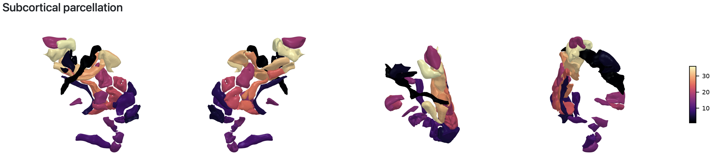

import { Steps } from '@astrojs/starlight/components';

:::tip[Don't panic!]
Most pipeline errors are easy to fix once you know what caused them. The pipeline provides detailed logs to help you identify and resolve issues quickly.
:::

## **How to assess an error**

When the pipeline fails, follow these steps to understand what went wrong:

<Steps>

1. **Check the terminal output**

    The terminal will show you which step failed. Look for lines starting with `ERROR` or `FAILED`. This gives you a quick indication of where the problem occurred.

2. **Read the `.nextflow.log` file**

    This file contains detailed information about the pipeline execution. It's located in your working directory (where you ran the `nextflow run` command).

    ```bash
    # View the last 100 lines of the log
    tail -n 100 .nextflow.log
    
    # Search for errors in the log
    grep -i error .nextflow.log
    ```

    :::tip[What will you see in the log file]
    The log file will show you information about which process failed (a.k.a., which processing steps returned an error), what exactly is the error message, which files were used, and which command was executed. Importantly, it will point you to the specific working directory in which the process was run. In there, you will find additional, more specific log files.
    :::

3. **Check the work directory**

   Each process creates a subdirectory in the `work/` folder. The terminal output shows you the work directory for the failed process (e.g., `work/a1/b2c3d4...`).

   Inside this directory, you'll find:
   - `.command.sh` - The script that was executed
   - `.command.out` - Standard output from the process
   - `.command.err` - Error messages from the process
   - `.command.log` - Combined output and errors

   ```bash
   # Navigate to the failed process directory
   cd work/a1/b2c3d4...
   
   # Check the error output
   cat .command.err
   ```

4. **Look for specific error messages**

    Sometimes the error message will be self-explanatory, and you will be able to understand the root of the issue. If not, you can look in the [common errors and solutions](/sf-pediatric/guides/troubleshooting/#common-errors-and-solutions) section for some help.

</Steps>

## **Common errors and solutions**

Here are the most frequent issues users encounter and how to fix them:

### **Missing or incorrect input folder**

**Error message:**
```
ERROR ~ Validation of pipeline parameters failed!

 -- Check '.nextflow.log' file for details
The following invalid input values have been detected:

* --input (input): the file or directory 'input' does not exist
```

**Cause:** The pipeline cannot find your input folder.

**Solutions:**
- Use **absolute paths** instead of relative paths: `/full/path/to/data` not `./data`
- Verify your BIDS directory structure matches the [inputs guide](/sf-pediatric/guides/inputs)
- Check file naming follows BIDS conventions (you can use the [online validator tool](https://bids-standard.github.io/bids-validator/))

### **Missing age column or not formatted correctly**

**Error message:**
```
ERROR ~ Missing 'age' column in participants.tsv
```

**Cause:** The `participants.tsv` file doesn't contain the required `age` column.

**Solution:** 
Add an `age` column to your `participants.tsv` file. See the [inputs guide](/sf-pediatric/guides/inputs#participantstsv-example) for the correct format. Remember that columns must be **tab-separated**, not space-separated.

### **Docker not running**

**Error message:**
```
ERROR ~ Cannot connect to the Docker daemon
```

**Cause:** Docker Desktop is not running or Docker is not installed.

**Solutions:**
- Start Docker Desktop
- Wait a few seconds for Docker to fully start
- If on an HPC cluster, use `-profile apptainer` instead of `-profile docker`

### **Incorrect shell selection**

**Error message:**
```
ERROR: No b-values are below the dti_max_shell_value threshold of 1200 for subject...
```

**Cause:** The pipeline's default shell selection (b ≤ 1200 for DTI, b ≥ 700 for fODF) doesn't match your acquisition protocol.

**Solution:**
Specify your shells manually using `--dti_shells` and `--fodf_shells`. See the [shell selection section](/sf-pediatric/guides/usage#shell-selection-for-dti-and-fodf-models) for details. Example:

```bash
--dti_shells "0 1500" \
--fodf_shells "0 1500 3000"
```

:::tip[For heterogeneous datasets]
If you have heterogeneous datasets with varying acquisition protocols, you can specify a different threshold for both DTI and fODF fitting. To do so, use the [`--dti_max_shell_value`](/sf-pediatric/guides/parameters/#dti-options) and/or the [`--fodf_min_shell_value`](/sf-pediatric/guides/parameters/#fodf-options).
:::

### **FreeSurfer license missing**

**Error message:**
```
No license file path provided. Please specify the path using --fs_license parameter.
```

**Cause:** You're using the `segmentation` profile without providing a FreeSurfer license.

**Solution:**
Get a free license from [here](https://surfer.nmr.mgh.harvard.edu/registration.html) and specify it with:

```bash
--fs_license /path/to/license.txt
```

### **Failed to fetch templates**

**Error message:**

```
==========================================================
ERROR: Failed to fetch templates from:
    ${params.templates_url}

${e.message}

This typically means the compute node has no internet access.
To resolve this, either:
    1. Run the pipeline once from a node with internet
        (templates will be cached for future runs)
    2. Manually download and extract the archive:
        curl -fSL ${params.templates_url} -o templates.tar.gz
        tar -xzf templates.tar.gz -C ${params.templates_download_path}
    3. Ask your sysadmin to place templates at:
        ${params.templates_download_path}
==========================================================
```

**Cause:** The pipeline attempted to download and fetch the template from your cache folder but did not succeed.

**Solutions:**
- If you have access to the internet, validate that the displayed `${params.templates_download_path}` truly exists and you have write access.
If you do not have write access, you can change the `${params.templates_download_path}` to a different location where you have write access.
- If you do not have access to the internet, refer to step #3 in [this section](/sf-pediatric/guides/nointernet/#downloading-the-containers)
for a guide on how to manually download the template to cache.

### **Permission denied errors**

**Error message:**
```
ERROR ~ Permission denied: '/path/to/output/sub-01/...'
```

**Cause:** The pipeline cannot write to the output directory.

**Solutions:**
- Check you have write permissions to the `--outdir` location
- Ensure the output directory is not owned by a different user
- On shared systems, verify the directory is not read-only

### **My subcortical structures look weird in my MultiQC report**

If your subcortical segmentation look similar to this in your MultiQC report:



**Cause:** It is likely that the specified ROIs for the subcortical regions are not correct.

**Solutions:**
- Validate that the specified ROIs for the subcortical regions using [`--subcortical_rois`](/sf-pediatric/guides/parameters/#atlases-options)
are correct and relaunch the pipeline with `-resume`.
- Alternatively, directly open the `*dseg.nii.gz` file found in your output folder using a visualization tool. If your segmentation do
not look as expected, then something might have went wrong in the registration process.

## **Still having issues?**

If you've tried the solutions above and are still stuck:

<Steps>

1. **Search existing issues**
   
   Check if someone else has encountered the same problem: [GitHub Issues](https://github.com/scilus/sf-pediatric/issues)

2. **Open a new issue**
   
   If you can't find a solution, create a new issue on [GitHub](https://github.com/scilus/sf-pediatric/issues) with:
   - **Your command** (the full `nextflow run` command)
   - **Error message** (from `.nextflow.log` or `.command.err`)
   - **Pipeline version** (the `-r` flag value, e.g., `0.2.2`)
   - **System information** (OS, Docker/Apptainer version)
   - **Input data description** (age range, acquisition parameters)

</Steps>
